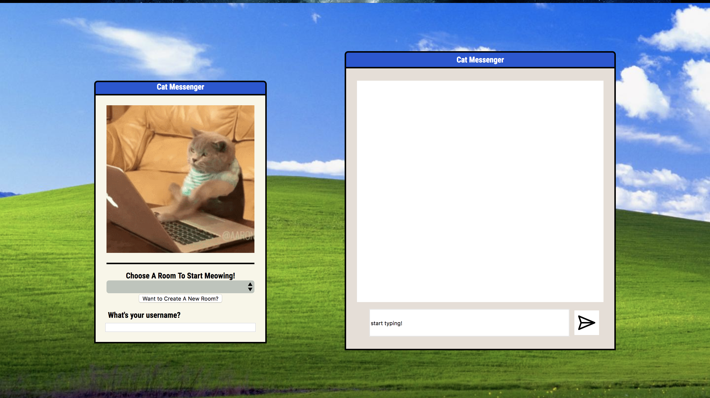

# chatterbox-client
This is a project I completed as a student at [hackreactor](http://hackreactor.com). I worked on this sprint solo.

This is the front end of a chatterbox app, in which students were able to communicate to each other using calls to an API. I am protected from XSS attacks. The back end of this project is found in the repo chatterbox-server; I worked with a pair.

## Image
<!-- .element height="50%" width="50%" -->

## Requirements
### To Run This Module
From within the root directory:
open the index.html file. The app itself will not make calls to the API because the API is now closed.